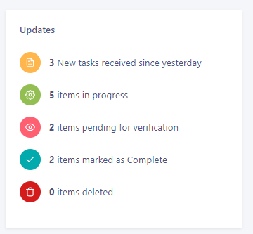

# Dashboard

#### Summary

These numbers signify overall completion of tasks for which are assigned to current user.

1. Below numbers will be filtered by  _**TaskOwner**_  set as USER\_ID
2. Below numbers should also be filtered by **ProjectId**

<figure><figcaption></figcaption></figure>

#### Updates

These numbers signifies number of tasks based on workflow status assigned to current user.

* Below numbers will be filtered by  _**TaskOwner**_  set as USER\_ID
* Below numbers should also be filtered by **ProjectId**

